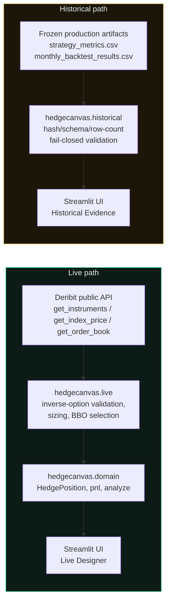

# HedgeCanvas Architecture (as implemented)

This describes only components that actually exist in this repository as
of commit `70039a7` plus the final QA/polish pass. It is written for
conversion into a thesis figure -- nothing here is aspirational.

## Components

| Package | Role |
|---|---|
| `hedgecanvas.domain` | Exchange-agnostic financial engine: `HedgePosition`, the deterministic expiry `pnl()` function, and `analyze()` (Max Profit/Max Loss/breakeven/coverage/boundary-scope). No I/O of any kind. |
| `hedgecanvas.live` | Deribit **public** JSON-RPC adapter (`DeribitClient`) plus instrument discovery, index-price/BBO retrieval, sizing, and the `build_*_quote` orchestration functions that turn live market data into `HedgePosition` inputs. |
| `hedgecanvas.historical` | Read-only frozen-artifact loader/validator: SHA-256 + exact-schema + row-count verification, literal asset/strategy filtering, and stored `wealth_end` extraction. No network code. |
| `hedgecanvas.ui` | Presentation-only: formatting, Plotly chart builders, and MarketState/HistoricalState -> message mappings. No financial logic. |
| `app.py` | Streamlit entry point. Sidebar navigation switches between the Live Designer and Historical Evidence renderers; only the selected one executes per rerun. |

## Two hard-separated data paths

The two paths do not intersect. `hedgecanvas.historical` never imports
`hedgecanvas.live` or `httpx`; `hedgecanvas.live` never reads a CSV. This
is enforced by a dedicated automated test
(`tests/historical/test_separation.py`), not only by convention.

## What does NOT exist

- No database. All state is either an in-memory Streamlit session or a
  local CSV file read at request time.
- No cloud service, deployment target, or hosting infrastructure.
- No order placement, account access, or private/authenticated Deribit
  endpoint anywhere in the codebase -- `DeribitClient` only issues
  `public/*` JSON-RPC methods and raises `ValueError` if asked to call
  anything else.
- No theoretical pricing model (Black-Scholes, IV surface, Greeks, Monte
  Carlo). Every option premium shown is a real observed Deribit
  top-of-book quote (live path) or a stored production backtest value
  (historical path) -- never a computed substitute.
- No backtest recomputation. The historical path only reads, verifies,
  filters, and formats values that were already computed by the frozen
  production run identified by the Run ID.

## Request flow inside the Live Designer

1. User selects Asset, portfolio size (quantity or USD value), and
   Strategy in the sidebar.
2. `hedgecanvas.live.fetch_index_price` supplies S0 from
   `public/get_index_price` for the asset's own index (never an option's
   `underlying_price`).
3. If the strategy needs options, `fetch_eligible_instruments` (short-TTL
   cached) discovers currently listed BTC/ETH **inverse** options only.
4. The user picks an expiry and strike(s); a Collar's call-strike control
   is restricted to `KC >= KP`.
5. `build_protective_put_quote` / `build_covered_call_quote` /
   `build_collar_quote` fetch the correct-side BBO (put ASK, call BID),
   size H from live `min_trade_amount` (floored, never rounded up), and
   normalize the native BTC/ETH premium into the domain's USD-per-unit
   convention using the same S0 snapshot.
6. The resulting `HedgePosition` is handed to
   `hedgecanvas.domain.analyze()` -- the only place payoff, coverage, and
   boundary-scope logic exists -- and the UI renders the returned result.

## Request flow inside Historical Evidence

1. `hedgecanvas.historical.load_historical_evidence()` resolves the
   artifact directory (`HEDGECANVAS_HISTORICAL_DIR` or the default
   `data/historical/frozen/`) and independently validates both canonical
   files: existence, exact SHA-256 of the raw bytes, exact ordered
   column schema, exact row count, and literal canonical key membership.
2. Only a fully `AVAILABLE` artifact is read into a DataFrame; any other
   state renders a structured "unavailable" message and nothing further.
3. `hedgecanvas.historical.filter_metrics` / `filter_wealth_path` /
   `wealth_end_series` apply literal asset/strategy filtering and sort by
   `decision_month` -- no arithmetic on the stored values.
4. `hedgecanvas.ui.historical_view_models.build_metrics_table` formats
   the eight canonical metric columns for display (percentage signs,
   friendly strategy labels, cost/credit wording) without altering the
   underlying numbers; `hedgecanvas.ui.historical_chart` plots the stored
   `wealth_end` column directly.
